# Logistic Regression Analysis Report: Telecommunications Customer Attrition

## Introduction
This report analyzes the IBM Telco Customer Churn data set to explain why customers leave a telecommunications provider for competitors. The workflow is reproducible from this repository and supports the assignment with data preparation notes, exploratory findings, logistic regression modeling, and visual evidence.

**Data source used for this run:** `/home/runner/work/Application-Customer-Attrition-Analysis/Application-Customer-Attrition-Analysis/data/WA_Fn-UseC_-Telco-Customer-Churn.csv` (cached repository CSV). When the assignment Excel workbook is unavailable, the repository falls back to the canonical public CSV mirror of the same Telco churn data.

## Part I. Data Preparation and Exploration

### 1. Data extraction and preparation
- The raw file was loaded into pandas and cached at `data/WA_Fn-UseC_-Telco-Customer-Churn.csv` for reproducibility.
- Column names and string values were stripped of leading/trailing whitespace.
- `TotalCharges` was converted from text to numeric.
- `11` blank `TotalCharges` values were coerced to missing and removed. These rows all belong to zero-tenure customers, so dropping them preserves a complete-case analysis without inventing bill totals.
- Redundant service labels were standardized by converting `No phone service` to `No` in `MultipleLines` and `No internet service` to `No` in internet add-on columns. This keeps categories interpretable and prevents perfect multicollinearity in the logistic model.
- `SeniorCitizen` was recoded to `Yes`/`No`, and the target `Churn` was encoded as `ChurnFlag` (1 = churn, 0 = stay).
- The prepared analysis table was saved as `data/prepared_telco_customer_churn.csv`.

### 2. How the data was prepared for the analysis
The preparation choices match the needs of logistic regression. Logistic regression requires a binary target, numeric predictors in machine-readable form, and well-defined categorical levels. Dummy encoding was applied automatically during modeling, while numeric predictors were standardized for the predictive model so coefficient magnitudes are comparable and solver convergence is stable.

### 3. Preliminary exploration findings
- The cleaned data contains **7,032 customers** and **19 predictors** plus the binary target.
- The churn rate is **26.6%**, indicating a moderately imbalanced but still usable classification problem.
- Contract type is strongly related to churn: **Month-to-month** customers churn at **42.7%**, while **Two year** customers churn at **2.8%**.
- Internet service matters as well: **Fiber optic** customers have the highest churn rate at **41.9%**.
- Payment behavior also differs by churn risk: **Electronic check** has the highest churn rate at **45.3%**.

#### Numeric predictor summary
| Variable | Mean | Median | Std. Dev. | Min | Max |
| --- | --- | --- | --- | --- | --- |
| tenure | 32.42 | 29.0 | 24.55 | 1.0 | 72.0 |
| MonthlyCharges | 64.8 | 70.35 | 30.09 | 18.25 | 118.75 |
| TotalCharges | 2283.3 | 1397.47 | 2266.77 | 18.8 | 8684.8 |

#### Selected categorical predictor summary
| Variable | Levels | Most common level | Share |
| --- | --- | --- | --- |
| gender | 2 | Male | 50.5% |
| SeniorCitizen | 2 | No | 83.8% |
| Partner | 2 | No | 51.7% |
| Dependents | 2 | No | 70.2% |
| PhoneService | 2 | Yes | 90.3% |
| InternetService | 3 | Fiber optic | 44.0% |
| Contract | 3 | Month-to-month | 55.1% |
| PaymentMethod | 4 | Electronic check | 33.6% |

### 4. Justification of tools and visualization formats
- **pandas** was used for ingestion, cleaning, reshaping, and summary statistics because the data is tabular and requires careful type conversion.
- **seaborn** and **matplotlib** were used because histograms, count plots, boxplots, bar charts, heatmaps, and ROC curves communicate distributional and classification behavior clearly.
- **scikit-learn** was selected for the predictive workflow because its preprocessing pipeline cleanly combines scaling, one-hot encoding, train/test splitting, and evaluation metrics.
- **statsmodels** was used alongside scikit-learn because it provides coefficient-level inferential statistics such as z-tests, p-values, and confidence intervals, which are necessary for a report-oriented interpretation of the regression model.

### Supporting graphics
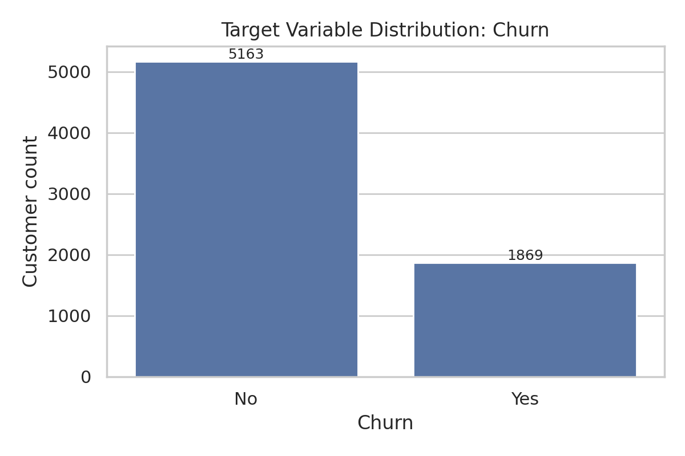

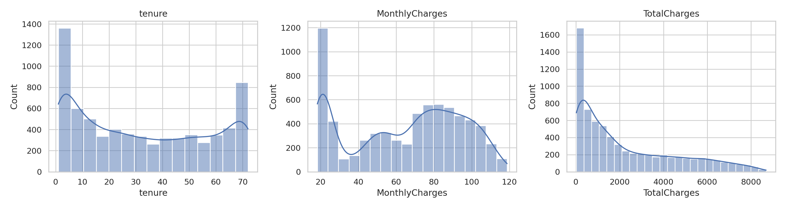

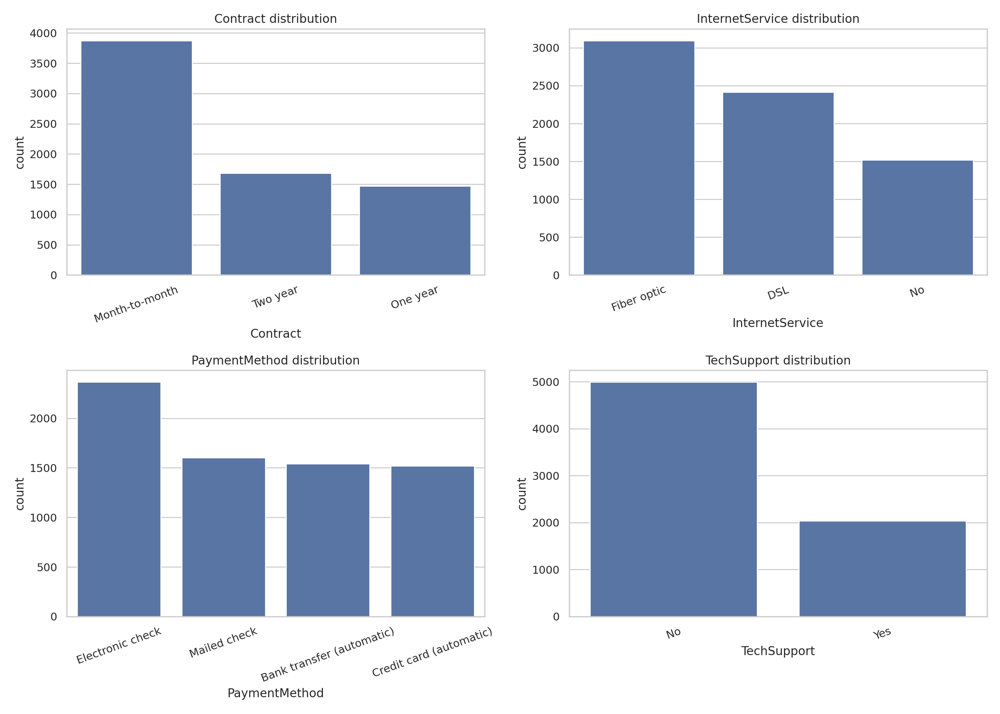

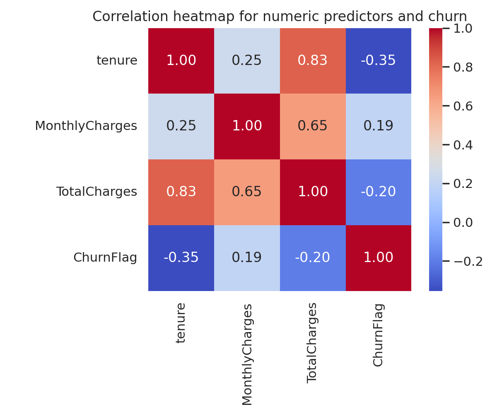

## Part II. Logistic Regression Analysis

### 1. Objective of the analysis
The goal of the analysis is to estimate the probability that a customer will churn and to identify which demographic, contract, billing, and service features are most strongly associated with attrition.

### 2. Target variable
The target variable is **`Churn`**, a binary field with values `Yes` and `No`. For modeling, it was encoded as **`ChurnFlag`** where `Yes = 1` and `No = 0`.

### 3. Univariate analysis of the predictors
The univariate review shows a mix of numeric and categorical predictors:
- `tenure` is right-skewed, with many newer customers and a long tail of retained long-tenure customers.
- `MonthlyCharges` spans a broad range, suggesting meaningful variation in service bundles and billing plans.
- `TotalCharges` is strongly right-skewed because it accumulates across tenure.
- Several categorical predictors are dominated by a few levels, especially `Month-to-month` contracts and electronic billing/payment combinations, which is common in churn studies.

### 4. Bivariate distribution analysis in the context of churn
- Customers who churn tend to have **lower tenure** and **higher monthly charges** than those who stay.
- Churn is highest among **month-to-month** customers and markedly lower for one-year and two-year contracts.
- **Fiber optic** customers show higher churn than DSL or customers without internet service.
- **Electronic check** users show higher churn than other payment groups.
- Support-oriented features such as **TechSupport = No** align with higher churn.

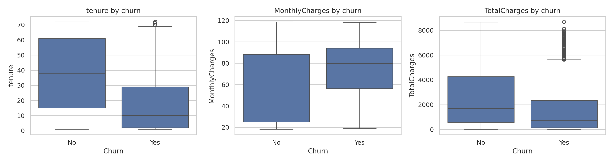

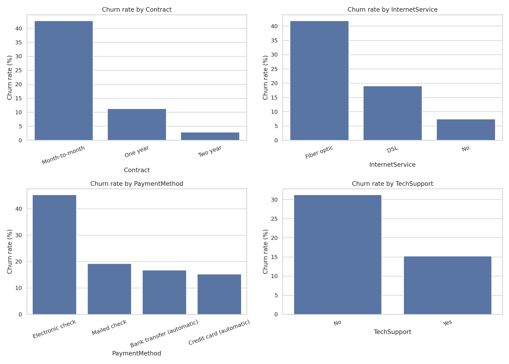

### 5. Logistic regression procedure
1. Split the cleaned data into training and test sets using an 80/20 stratified split (`random_state = 42`).
2. Standardized numeric predictors (`tenure`, `MonthlyCharges`, `TotalCharges`) for the predictive model.
3. One-hot encoded all categorical predictors with the first level dropped as the reference category.
4. Fit a scikit-learn logistic regression model for predictive evaluation.
5. Fit a second statsmodels logistic regression on the full cleaned data to estimate coefficient significance, odds ratios, and confidence intervals.
6. Evaluated out-of-sample classification performance with accuracy, precision, recall, F1 score, and ROC AUC.

### 6. Findings and model accuracy
#### Predictive performance on the holdout test set
| Metric | Value |
| --- | --- |
| Accuracy | 0.804 |
| Precision | 0.649 |
| Recall | 0.570 |
| F1 score | 0.607 |
| ROC AUC | 0.836 |

The model achieves **80.4% accuracy** and an **ROC AUC of 0.836**, which indicates good discrimination for a business churn screen. Precision and recall are both moderate, which is expected because churn is the minority class and some false positives are acceptable in retention campaigns.

#### Most statistically significant predictors
| Feature | Coefficient | Odds ratio | p-value | Effect on churn odds |
| --- | --- | --- | --- | --- |
| tenure | -0.058 | 0.9441 | <0.0001 | lower |
| Contract = Two year | -1.415 | 0.2428 | <0.0001 | lower |
| Contract = One year | -0.762 | 0.4667 | <0.0001 | lower |
| TotalCharges | 0.000 | 1.0003 | <0.0001 | higher |
| PaymentMethod = Electronic check | 0.386 | 1.4704 | 0.0003 | higher |
| PaperlessBilling = Yes | 0.289 | 1.3354 | 0.0005 | higher |
| MultipleLines = Yes | 0.677 | 1.9689 | 0.0007 | higher |
| InternetService = No | -2.730 | 0.0652 | 0.0028 | lower |
| InternetService = Fiber optic | 2.682 | 14.6112 | 0.0030 | higher |
| StreamingTV = Yes | 0.997 | 2.7090 | 0.0069 | higher |

Interpretation highlights:
- Longer **tenure** reduces churn odds substantially.
- **One-year** and **two-year contracts** are associated with much lower churn odds than month-to-month service.
- **Electronic check** payment is associated with higher churn odds.
- **Paperless billing** and being a **senior citizen** are associated with higher churn odds after controlling for the other variables.
- Lower-support service profiles, especially lacking **TechSupport** or comparable stabilizing features, are directionally riskier even when not every dummy is significant at the 0.05 level.

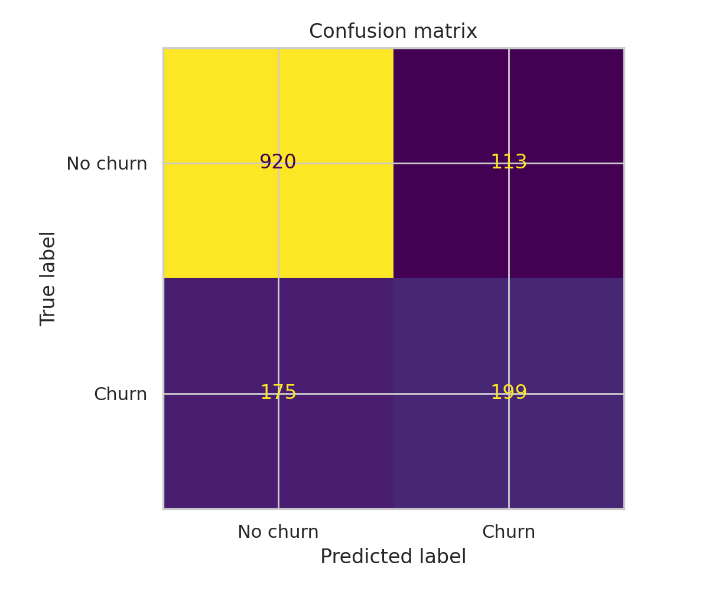

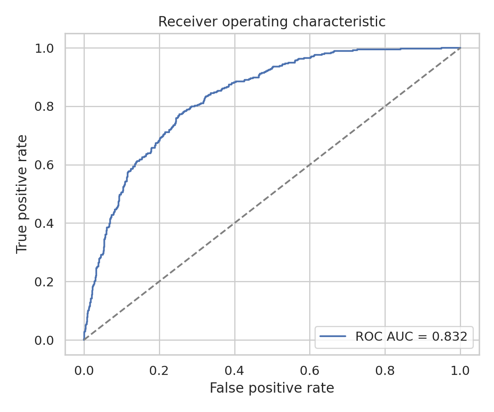

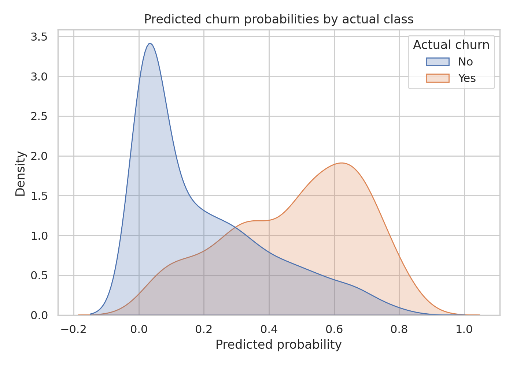

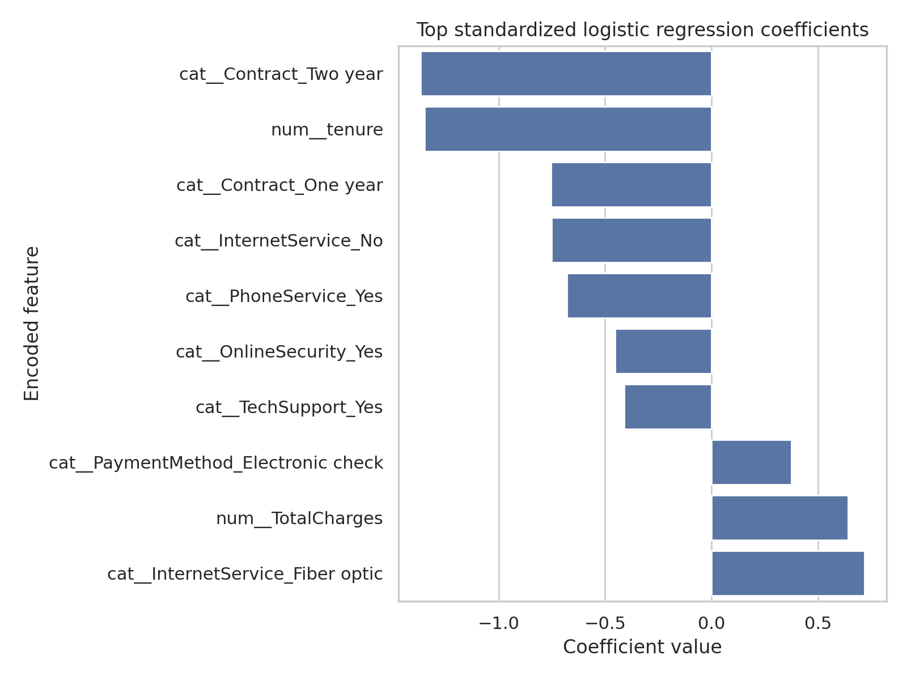

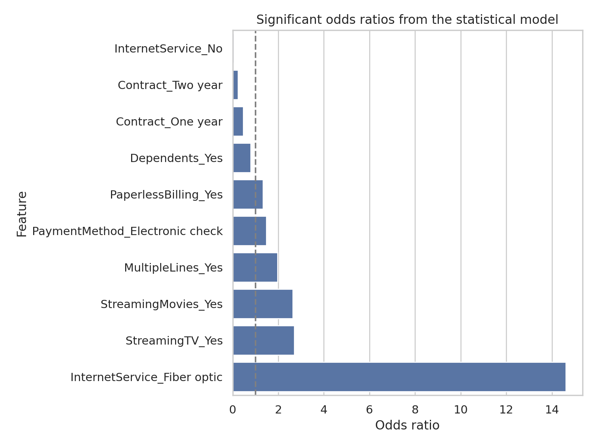

## Part III. Summary of Findings

### 1. Whether the data is discriminating
Yes. The data is meaningfully discriminating because the model separates churners from non-churners with an ROC AUC of **0.836**. The probability-density plot and ROC curve show that churners receive systematically higher predicted probabilities than non-churners, even though the classes still overlap.

### 2. Variables that significantly interact with the target variable
Using the logistic regression significance tests, the strongest variables associated with churn are:
- `tenure`
- `Contract = Two year`
- `Contract = One year`
- `TotalCharges`
- `PaymentMethod = Electronic check`
- `PaperlessBilling = Yes`
- `MultipleLines = Yes`
- `InternetService = No`
- `InternetService = Fiber optic`
- `StreamingTV = Yes`

In practical business terms, customer commitment structure (contract length), billing/payment behavior, and service configuration explain the largest share of churn risk.

### 3. Limitations of the logistic regression model
- Logistic regression assumes a linear relationship between predictors and the log-odds of churn, which may oversimplify customer behavior.
- The analysis is observational, so statistically significant effects should not be interpreted as direct causal drivers.
- Churn is the minority class, so threshold choice affects the precision/recall trade-off.
- The report does not include engineered interaction terms or non-linear transformations; adding them could improve fit but would reduce the simplicity and transparency of the baseline model.
- The data reflects one telecommunications portfolio and may not generalize perfectly to other markets or time periods.

## References
- Hosmer, D. W., Lemeshow, S., & Sturdivant, R. X. (2013). *Applied Logistic Regression* (3rd ed.). Wiley.
- James, G., Witten, D., Hastie, T., & Tibshirani, R. (2021). *An Introduction to Statistical Learning* (2nd ed.). Springer.
- IBM Sample Data. *Telco Customer Churn* data set, distributed through the public mirror referenced above.
